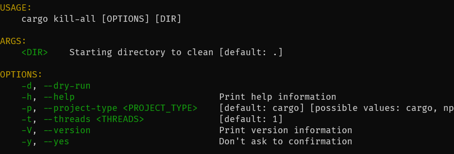

# Cargo Kill
### Remove `target`|`node_modules` recursively from directories

## Installation 
> `cargo install cargo-kill-all`

## Usage 
> `cargo-kill-all /home/Documents/ -t 4 -p [npm/cargo]`

Use -p npm to delete all node_modules and `-p cargo` to delete `target` from **cargo** projects

## This project is heavily inspired by [dnlmlr's](https://github.com/dnlmlr) crate 
[cargo-clean-all](https://github.com/dnlmlr/cargo-clean-all) 

If you like this project, go check that out too
