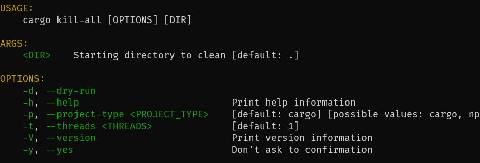
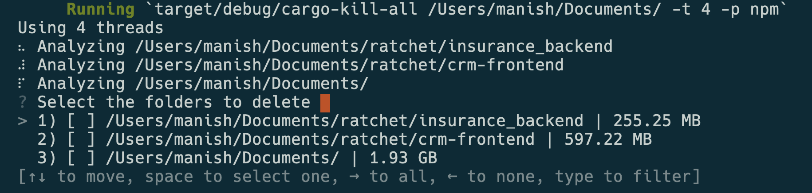

# Cargo Kill

### Reclaim disk space from build/cache directories across cargo and npm projects, in one pass

## Installation

> `cargo install cargo-kill-all`

## Usage

> `cargo-kill-all /home/Documents/ -t 4`

A single pass scans the tree and lists every detected project. No project-type
flag is needed — cargo and npm projects show up together, and a directory
matching multiple kinds (e.g. `Cargo.toml` + `package.json`) appears once with
all its targets unioned.

### What gets cleaned

| Kind  | Identifier     | Targets                                                          |
| ----- | -------------- | ---------------------------------------------------------------- |
| cargo | `Cargo.toml`   | `target/`                                                        |
| npm   | `package.json` | `node_modules/` plus framework caches (see table below)          |

For npm projects, framework caches are inferred from `dependencies` and
`devDependencies` in `package.json`:

| Dependency       | Cache directories       |
| ---------------- | ----------------------- |
| `next`           | `.next`                 |
| `nuxt` / `nuxt3` | `.nuxt`, `.output`      |
| `@sveltejs/kit`  | `.svelte-kit`           |

Each detected project is a single selectable row whose size is the sum of all
its detected directories; selecting it removes all of them.

More detector kinds (flutter, gradle, etc.) can be added by appending entries
to `PROJECT_KINDS` in [src/utils.rs](src/utils.rs).

### Including `.git`

Pass `--include-git` to also surface `.git` directories. With this flag:

- Any directory containing `.git` becomes a row, **even without** a
  `Cargo.toml`/`package.json` — useful for cleaning out abandoned local
  checkouts.
- For projects already detected by another kind, `.git` is appended to that
  project's targets list.

**This wipes local repository history.** The `.git` entry is shown in the
row's targets before the confirmation prompt.

## This project is heavily inspired by [dnlmlr's](https://github.com/dnlmlr) crate

[cargo-clean-all](https://github.com/dnlmlr/cargo-clean-all)

### Demo

If you like this project, go check that out too
